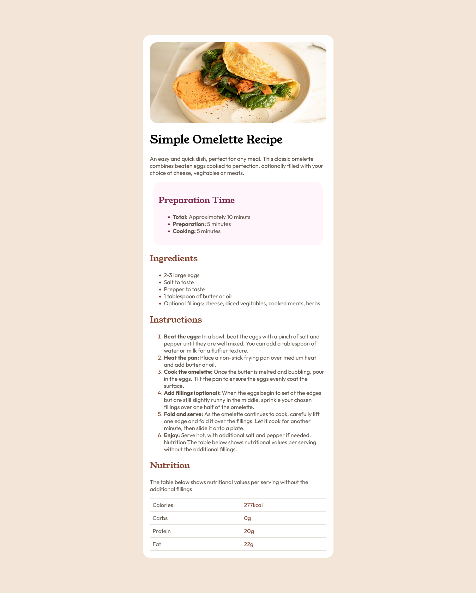

# Frontend Mentor - Recipe page solution

This is a solution to the [Recipe page challenge on Frontend Mentor](https://www.frontendmentor.io/challenges/recipe-page-KiTsR8QQKm). Frontend Mentor challenges help you improve your coding skills by building realistic projects. 

## Table of contents

- [Overview](#overview)
  - [Screenshot](#screenshot)
  - [Links](#links)
- [My process](#my-process)
  - [Built with](#built-with)
  - [What I learned](#what-i-learned)
  - [Future Improvements](#Future-improvements)
- [Author](#author)
- [Acknowledgments](#acknowledgments)

## Overview

### Screenshot

### Links

- Live Site URL: [Add live site URL here](https://coffe3.github.io/Recipe-page/)])

## My process

### Built with

- Semantic HTML5 markup
- CSS custom properties
- Flexbox
- CSS Grid
- Mobile-first workflow

### What I learned

- Working on this project reinforced my understanding of:

- Structuring a webpage using semantic HTML tags (header, section, article, main)

- Styling with CSS, including the use of flexbox and CSS grid

- Creating visually appealing UI with spacing, typography, and color contrast

- Implementing reusable styles and maintaining a clean CSS structure

### Future Improvements

- Improve responsiveness to better adapt to different screen sizes

- Enhance accessibility by adding better ARIA attributes

- Optimize images for better performance

- Add animations for a smoother user experience

## Author

- Frontend Mentor - [@coffe3](https://www.frontendmentor.io/profile/coffe3)
- Twitter - [@coffe3z](https://x.com/coffe3z)

## Acknowledgments

Thanks to Frontend Mentor for providing this challenge, which helped improve my front-end development skills.
Author
